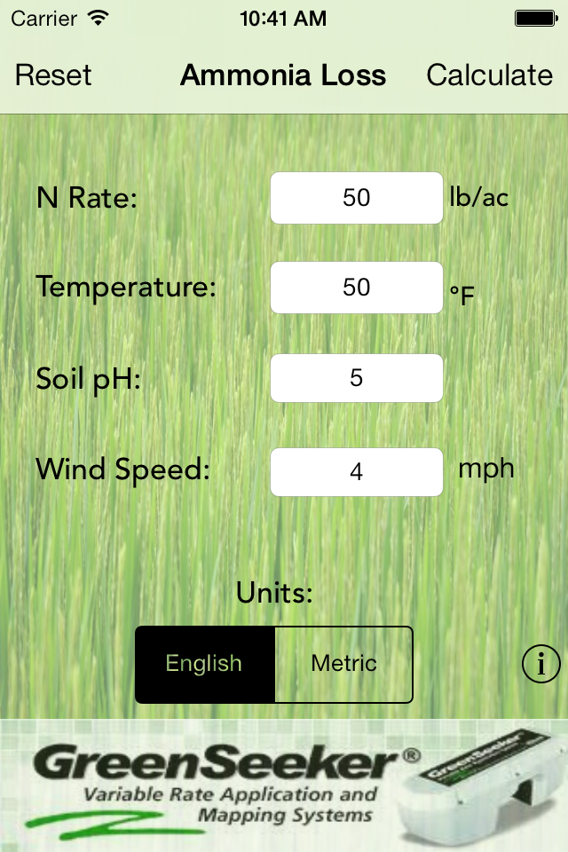
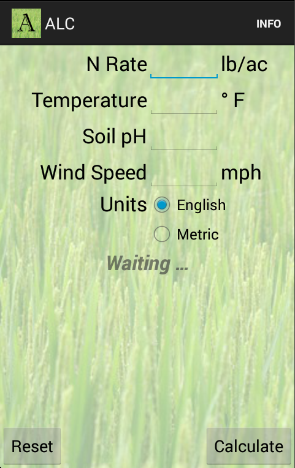

These are the (An)droids You're Looking for
===========================================
:author:              Lee Fent
:copyright:           Lee Fent 2014
:backend:             slidy
:max-width:           45em
:source-highlighter:  source-highlight
:footer!:
:data-uri:

These are the (An)droids You're Looking for
-------------------------------------------
_A brief introduction to developing for the Android platform_

image::images/android-logo.png[]

**by Lee Fent**

Where we started
----------------

Historically the Department of Plant and Soil Sciences at Oklahoma State
University had a web application available to help producers calculate the
Ammonia Loss of their soil (as well as many other related calculators).

When we started we had a pretty well defined scope of functionality and a
guideline for what needed to be included and what didn't need to be included.

[role="incremental"]
*This was invaluable*

The iOS development process
---------------------------

* Initially developed an iOS6 application in Summer of 2013.
* One student worker worked full time during the summer to produce the
  application
* Much of this time was legwork, getting calculations together, generating 
  graphics for one screen, proofing text.

The Android development process
-------------------------------

* Developed the Android application over the course of four (4) normal working
  days.  
* Moderate legwork for generating resized/resampled graphics.
* No additional text proofing or calculation review needed.

The downside: you can't really share code, but the assets were a good start.

Where we are now
----------------

Here are (emulated) screenshots of the original iOS Application and the 
subsequent Android Application. There are some minor differences but the 
functionality is identical.  

The iOS application
-------------------

The Android application
------------------------

Getting things going
--------------------

There are several ways to get started with Android development.

[role="incremental"]
* Eclipse with ADT: (Eclipse with the Android SDK included)
* Eclipse (Standalone): Just add the Google Android SDK
* Manual Installation: Go old school and be cool!
* Android Studio: Careful, it *is* a beta/technology preview.
* Other IDE's provide integration too: Idea and Netbeans are two.

[role="incremental"]
We used the Standalone ADT option to avoid possibly contaminating (i.e. 
breaking) other development projects.

Core SDK features
-----------------

There are several utilities included in the SDK. 

[role="incremental"]
* Android SDK Manager: Used to download optional parts and system images.
* Android Virtual Device Manager: Used to manage your configured emulators.
* Android Lint: The most nit-picking-est tool you could ever imagine.
* `android`: The command-line interface to many Android SDK related functions.

_All of the IDE's provide similar functionality for these features_

Intel emulator to the rescue
----------------------------

_a.k.a. Faster! Must go faster!_

Save yourself headache and heartache.  A conservative estimate would be a 2x
speed improvement over the non-accelerated emulators, probably closer to
3x-4x.

Go download and configure the Intel Hardware Accelerated Execution Manager for
your OS.

Much faster startup and interaction for Intel Atom based emulator images.

https://software.intel.com/en-us/android[]

https://software.intel.com/en-us/android/articles/intel-hardware-accelerated-execution-manager[]

Design and Visual Layout
------------------------

It's almost as much fun as CSS!  That might not be good news.

[role="incremental"]
* dp: Density Independent Pixels
* sp: Scaled Pixels
* pt: Traditional Points
* px: Pixels -> Don't Use!
* mm: Millimeters
* in: Inches

TIP: Guidelines suggest 48dp for "Touchable" items (buttons, icons, controls)
http://developer.android.com/training/multiscreen/index.html[]

Layouts
-------

A layout defines the visual structure for your apps UI.

Since there are lots of devices, you need to think about lots of layouts.

_Fragments_ are a reusable layout that represents a behavior or a portion of 
user interface in an _Activity_.

Emulators
---------

Emulators are very configurable, which is a mixed blessing.

Different hardware setups (screen size, screen density, and processor)

Different software installations (Android version and Google API)

Keyboard Shortcuts: 
http://developer.android.com/tools/help/emulator.html[]

Permissions
-----------

Android has a very exhaustive list of permissions that an application can
request.  

Examples:

[role="incremental"]
* `android.permission.READ_SMS` lets you read SMS messages the device has 
  received
* `android.permission.RECORD_AUDIO` enables you to record audio.
* `android.permission.BLUETOOTH` enables interaction with paired Bluetooth(TM).

However having permission to do something isn't the same thing as having the 
hardware.  Not all Android devices have the same abilities.

Resources
---------

Resources (generally subdirectories of the `res/` directory) are able to be 
targetted for a surprising number of environments, conditions, and
configurations.

You can provide resources tailored by the following criteria:
[role="incremental"]
* Language: Prefer English, French, or Hmong?  Android has you covered!
* Carrier: ex. AT&T, Verison, or O2
* Layout Direction: ex. Right-to-Left or Left-to-Right
* Orientation: Landscape or Portrait
* Night Mode: Who knew, right?

TIP: This list is not exhaustive by any means, please consult the
  documentation below for a far more comphrensive list.

More information:
http://developer.android.com/guide/topics/resources/providing-resources.html#AlternativeResources[]

Localization (i18n)
-------------------

Used to help make your application more accessible.  

Defaults back up the specificity chain to find defaults.
[role="incremental"]
* So `res/values-fr-rCA/strings.xml` would be used in for devices set to use 
  Canadian French.
* While `res/values-fr/strings.xml` would provide values not covered above.
* And the fallback of `res/values/strings.xml` would be used as a final 
  default.

TIP: The Emulator and Visual Layout editor both provide access to swapping
  your Localization settings around, so testing this is easy.

[role="incremental"]
Sadly, `res/values-en-rOKIE/strings.xml` is *still* under review.

Activities
----------

Roughly equal to a page in a web application.  

Provides the user interface into your application.

Have a detailed (and complex) Lifecycle

Activity Lifecycle
------------------

Android Activities go through many states during their life.  

[role="incremental"]
* onCreate():
* onStart():
* onResume():
* onPause():
* onStop():
* onRestart():
* onDestroy():

In addition, other parts of an Android application (e.g. a _Fragment_) may have
other related lifecycle stages.

Fragments
---------

Newer versions of Android recognized the problem in needing multiple
_Activities_ to handle the widely varying sizes of screens and devices.

Fragments were the solution to this problem.

*Not required to use Fragments*

Fragments allow for interface composition and enables you to deal with 
differing layouts.

Intents
-------

Intents are passed amongst the building blocks of your Android application.

Intents are can pass a small amount of data, but there are better ways to pass
larger messages.

Intents can be used to start an activity to start up, broadcast state
messages, or interact with services.

Intents are don't require a response and are asynchronous.  But you can do 
callbacks on completion.

AndroidManifest.xml
-------------------

The mother of all XML files. 

Basically a list of all the options, configurations, and structure of the 
application itself.

* Activities
* Services
* Intents
* Broadcast Receivers
* Content Providers
* Permissions
* Android uses-sdk for min and target SDK versions

Visual Editors
--------------

* Menu
* Layout
* Strings

Now for things we didn't actually use
-------------------------------------

This is only a partial list.

Content Providers
-----------------

Allow you to internally *or* externally offer access to your internal 
application data.

Examples of Content Providers included in Android:

* Contacts
* Media Store
* System Settings

Broadcast Receivers
-------------------

An implementation of Observer pattern or Pub/Sub architecture.

Can wake up dormant applications *or* services.

Requires additions to the AndroidManifest.xml, both as an _intent_ and the 
related _uses-permission_ entry.

Services
--------

Run behind the scenes and have no user interface.  Useful for features like 
background refresh.

Can be started via a Broadcast Receiver.

Sneaky Tricks
-------------

A couple of tricks that aren't really all related to Android development.

* Use the Web Browser on the Emulator to test websites.  While not as fast as
  the actual device, you can use it to test RWD sites on a variety of sizes
  and densities.
* Roll-Out w/o a costly tool.  You can distribute the .apk files via normal
  file services and access them directly.  Not a great policy, but it can be
  great in a pinch.
* `android:layout_weight="1"` and `android:layout_width="0dp"` for equal 
  spacing on horizontal layout.

The Good
--------

* Documentation: So much good documentation, (unsurprisingly) well indexed and
  searchable.
* Examples: Lots and lots of examples of how to do things. 
* Flexibility: Your application can react and reconfigure itself for a 
  bewildering array of options.
* Testing: A random touches tester to help beat your application up? 
  Brilliant!  UI Testing, Service Testing, Content Provider Testing, Activity
  Testing, and Accessibility Testing.

The Bad
-------

* Fragmentation: Yup, I said the F-word.
* Layouts: The graphical editor will drive you crazy.
* Bugs in Emulators: What a wonderful way to waste half a day.

The Downright Ugly
------------------

* XML: There is XML, literally, everywhere you look and it's a total mystery
  how it's stitched together.
* Sometimes things break: In rage-inducingly obfuscated ways, made worse by
  how well problems are normally highlighted.

Accessibility
-------------

Lots of options, such as _TalkBack_ and _Explore by Touch_.

[role="incremental"]
* Use Hint text where possible
* Provide ContentDescriptions (via the Strings resources)
* Remember font sizes *should* be adjustable.

Websites and External Resources
-------------------------------

Just a few helpful references and websites

* http://developer.android.com/develop/index.html[]
* http://developer.android.com/design/index.html[]
* http://developer.android.com/distribute/index.html[]
* http://developer.android.com/training/index.html[]
* http://developer.android.com/tools/index.html[]
* http://stackoverflow.com/questions/tagged/android[]

Closing
-------
Thanks, that's all folks!

Presentation:
  https://github.com/lafent/netc/tree/master/2014/android/presentation.adoc[]

Questions?

Who was that fast talkin' man?
------------------------------
Lee Fent

* Web Developer for Oklahoma State University DASNR
* Secret Agent Man
* A Hyper-Intelligent Shade of the Colour Blue

_At least one of those three is true._

//---------------------------------------------------------------------------//
// vim: set syntax=asciidoc:
// vim: set ft=asciidoc:
//---------------------------------------------------------------------------//
